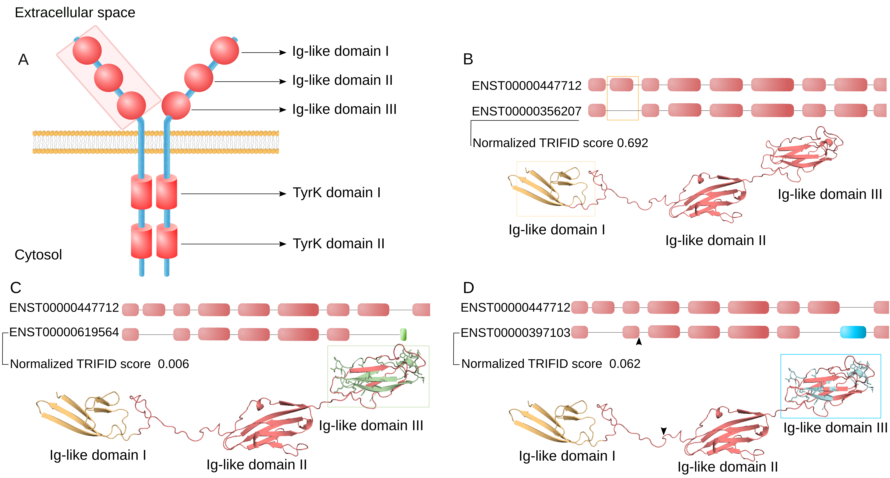
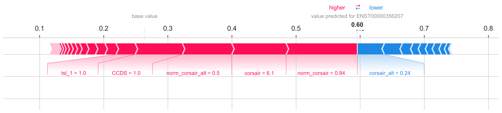
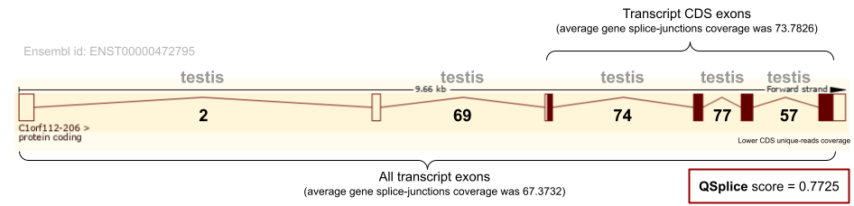
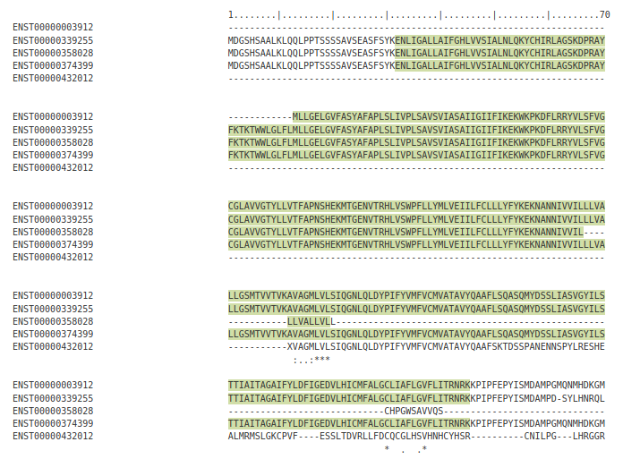

<div align="center">
  <br>
</div>

-----------------

[`TRIFID`](https://github.com/fpozoc/trifid) is the name of the method described in the manuscript: [*Assessing the functional relevance of splice isoforms*](https://academic.oup.com/nargab/article/3/2/lqab044/6281449?searchresult=1) published in [NAR Genomics and Bioinformatics](https://academic.oup.com/nargab/issue/3/2) the 22 May 2021.

<details><summary>Citation</summary>

```bibtex
@article{10.1093/nargab/lqab044,
    author = {Pozo, Fernando and Martinez-Gomez, Laura and Walsh, Thomas A and Rodriguez, José Manuel and Di Domenico, Tomas and Abascal, Federico and Vazquez, Jesús and Tress, Michael L},
    title = "{Assessing the functional relevance of splice isoforms}",
    journal = {NAR Genomics and Bioinformatics},
    volume = {3},
    number = {2},
    year = {2021},
    month = {05},
    abstract = "{Alternative splicing of messenger RNA can generate an array of mature transcripts, but it is not clear how many go on to produce functionally relevant protein isoforms. There is only limited evidence for alternative proteins in proteomics analyses and data from population genetic variation studies indicate that most alternative exons are evolving neutrally. Determining which transcripts produce biologically important isoforms is key to understanding isoform function and to interpreting the real impact of somatic mutations and germline variations. Here we have developed a method, TRIFID, to classify the functional importance of splice isoforms. TRIFID was trained on isoforms detected in large-scale proteomics analyses and distinguishes these biologically important splice isoforms with high confidence. Isoforms predicted as functionally important by the algorithm had measurable cross species conservation and significantly fewer broken functional domains. Additionally, exons that code for these functionally important protein isoforms are under purifying selection, while exons from low scoring transcripts largely appear to be evolving neutrally. TRIFID has been developed for the human genome, but it could in principle be applied to other well-annotated species. We believe that this method will generate valuable insights into the cellular importance of alternative splicing.}",
    issn = {2631-9268},
    doi = {10.1093/nargab/lqab044},
    url = {https://doi.org/10.1093/nargab/lqab044},
    note = {lqab044},
    eprint = {https://academic.oup.com/nargab/article-pdf/3/2/lqab044/38108084/lqab044.pdf},
}
```
</details>

- [Introduction](#introduction)
- [Installation instructions](#installation-instructions)
- [Model reproducibility](#model-reproducibility)
  - [Data sources](#data-sources)
  - [Preprocessing](#preprocessing)
  - [Model training](#model-training)
- [Availability of data](#availability-of-data)
  - [`TRIFID` predictions and predictive features](#trifid-predictions-and-predictive-features)
  - [Other useful links](#other-useful-links)
- [Example: Fibroblast growth factor receptor 1 (FGFR1)](#example-fibroblast-growth-factor-receptor-1-fgfr1)
  - [Loading the model](#loading-the-model)
  - [Loading the SHAP predictions for a single isoform](#loading-the-shap-predictions-for-a-single-isoform)
- [TRIFID modules](#trifid-modules)
  - [QSplice](#qsplice)
    - [Example: Chromosome 1 open reading frame 112 (C1orf112)](#example-chromosome-1-open-reading-frame-112-c1orf112)
  - [Pfam effects](#pfam-effects)
    - [Example: NIPA like domain containing 3 (NIPAL3)](#example-nipa-like-domain-containing-3-nipal3)
  - [Fragment labelling](#fragment-labelling)
- [Directory structure](#directory-structure)
- [Author information](#author-information)
- [Release History](#release-history)
- [Contributing](#contributing)
- [License](#license)

# Introduction

`TRIFID` is a Machine Learning based-model that aims to predict the functionality of every single isoform in the genome. This model has been designed to be accurate, interpretable and reproducible.

This repository has been created to give the bioinformatician a whole recipe for how this method was created. However, if the user is not interested in the complete installation and execution of `TRIFID`, jumps directly to [section 4](#availability-of-data), where the `TRIFID` predictions are described. Furthermore, the user can be interested in the `TRIFID` side modules that generate only some predictive features. If it is the case, go to [section 6](#trifid-modules).

Go back to the table of Contents presented above, [open an issue in this repository](https://github.com/fpozoc/trifid/issues/new) or [contact directly with the main `TRIFID` developer](#author-information) if the user wants to know more about any other part of the project.

# Installation instructions

Run the silent installation of Miniconda/Anaconda in case you don't have this software in your environment.

```sh
wget https://repo.anaconda.com/miniconda/Miniconda3-latest-Linux-x86_64.sh
bash Miniconda3-latest-Linux-x86_64.sh -b -p $HOME/miniconda3
```

Once you have installed Miniconda/Anaconda, create a Python 3.7 environment.

```sh
conda create --name trifid python=3.7
conda activate trifid
```

Clone this repository and install it inside your recently created Conda environment.

```sh
git clone https://github.com/fpozoc/trifid
cd trifid
pip install .

# optional
pip install .[extra] # to install the visualization dependencies
pip install .[interactive] # to install the interactive dependencies
```

# Model reproducibility

## Data sources

The `TRIFID` model was initially trained with 45 predictive features of a subset of the protein isoforms annotated in [GENCODE Release 27 (GRCh38.p10)](https://www.gencodegenes.org/human/release_27.html). Features have been described [here](https://drive.google.com/file/d/1XvAA0tNS6AOMMptMB9K1IHm6b7likAqc/view?usp=sharing). Two extra features has been added in the second release.

To set and create these features, we parsed some existing databases and created some specific modules for the task:

- [GENCODE genome annotation statistics](https://www.gencodegenes.org/human/stats.html) for protein-coding transcripts. Data sets are available in the [GENCODE ftp server](ftp://ftp.ebi.ac.uk/pub/databases/gencode/Gencode_human).
- [APPRIS methods](https://appris.bioinfo.cnio.es/#/help/methods) to quantify protein structural information, functionally important residues, conservation of functional domains and evidence of cross-species conservation. Data sets are available in the [APPRIS http server](https://appris.bioinfo.cnio.es/#/).
- [PhyloCSF scores](https://github.com/mlin/PhyloCSF/wiki) as a complementary measure of evolutionary conservation. Pre-computed scores for some genome annotation versions are available in this repository.
- ALT-Corsair (`APPRIS` module) to quantify the age of the last common ancestor of the most distant orthologue that fulfills the search criteria, reporting a score representing the age of the oldest species maps to the whole protein sequence. It is a method based on the [Corsair](http://appris-tools.org/#/help/methods) module in APPRIS. Pre-computed scores for some genome versions are available in the APPRIS webserver.
- [QSplice](#qsplice) (`TRIFID` module) to quantify splice junctions coverage and our [RNA-seq Snakemake pipeline](https://github.com/fpozoc/appris_rnaseq) to perform a comprehensive RNA-seq analysis. Pre-computed scores for GENCODE 27 available [here](https://drive.google.com/file/d/16RKG2Hv5XizQvktcyCiAL6CHKlwJ_aeL/view?usp=sharing). More details about this module in section [below](#qsplice).
- [Pfam effects](#pfam-effects) (`TRIFID` module) to quantify the effect of Alternative Splicing over [Pfam domains](https://pfam.xfam.org/) of every protein-coding gene for the entire genome. Pre-computed scores for some genome annotation versions are available in [here](https://drive.google.com/file/d/1P6dra0JYng2uqW34i0eEjsi2GgHQOBte/view?usp=sharing). More details about this module in the section [below](#pfam-effects).
- [Fragment labelling](#fragment-labelling) (`TRIFID` module) to label genome isoforms in duplications or fragments for a further score correction step. More details about this module in [below](#fragment-labelling).

The data sources to reproduce our analysis are available for some genome versions through this [shared point](https://drive.google.com/drive/u/0/folders/1RL6BaYBbRdvQlPkFkk7XVSPuKsbR9w-5). In the `source` folder, the files that a user would need to run `TRIFID` on GENCODE 27 are freely available. Moreover, the [`config`](https://github.com/fpozoc/trifid/blob/master/config/config.yaml) file contains the `source` file paths to create a data set to be trained with `TRIFID`. The user can modify these paths but it is recommendable to run everything inside the `TRIFID` previously downloaded folder.

Both predictions and features will be available with the second release of `TRIFID` [here](https://drive.google.com/drive/u/0/folders/1oRwduk_u3UIZgrtB0DbfAGSwhNQVOZn4).

## Preprocessing

Below is an example of how to reproduce the method from scratch for GENCODE 27. The user has to follow the next steps:

1. To download the annotation files from GENCODE and APPRIS websites:

```bash
cd trifid

# GENCODE data
mkdir -p data/external/genome_annotation
curl ftp://ftp.ebi.ac.uk/pub/databases/gencode/Gencode_human/release_27/gencode.v27.annotation.gtf.gz -o data/external/genome_annotation/GRCh38/g27/gencode.v27.annotation.gtf.gz
curl ftp://ftp.ebi.ac.uk/pub/databases/gencode/Gencode_human/release_27/gencode.v27.annotation.gff3.gz -o data/external/genome_annotation/GRCh38/g27/gencode.v27.annotation.gff3.gz

# APPRIS data
mkdir -p data/external/appris
curl http://apprisws.bioinfo.cnio.es/pub/current_release/datafiles/homo_sapiens/e90v35/appris_data.principal.txt -o data/external/appris/GRCh38/g27/appris_data.principal.txt
curl http://apprisws.bioinfo.cnio.es/pub/current_release/datafiles/homo_sapiens/e90v35/appris_data.appris.txt -o data/external/appris/GRCh38/g27/appris_data.appris.txt
curl http://apprisws.bioinfo.cnio.es/pub/current_release/datafiles/homo_sapiens/e90v35/appris_data.transl.fa.gz -o data/external/appris/GRCh38/g27/appris_data.transl.fa.gz
```

1. To compute the splice-junction coverage scores, from a complete set of RNA-seq samples for a wide variety of tissues. Notice that these samples have been processed through an extensive computational pipeline. We provide these pre-computed scores for some genome annotation versions [here](https://drive.google.com/file/d/16RKG2Hv5XizQvktcyCiAL6CHKlwJ_aeL/view?usp=sharing).

```bash
python -m trifid.preprocessing.qsplice \
    --gff   data/external/genome_annotation/GRCh38/g27/gencode.v27.annotation.gff3.gz \
    --outdir data/external/qsplice/GRCh38/g27 \
    --samples out/E-MTAB-2836/GRCh38/STAR/g27 \
    --version g
```

3. To compute the Pfam effects of the Alternative Splicing over reference isoform of every protein-coding gene for the entire genome. We provide these pre-computed scores for some genome annotation versions [here](https://drive.google.com/file/d/1P6dra0JYng2uqW34i0eEjsi2GgHQOBte/view?usp=sharing).

```bash
python -m trifid.preprocessing.pfam_effects \
    --appris data/external/appris/GRCh38/g27/appris_data.appris.txt \
    --jobs 10 \
    --seqs data/external/appris/GRCh38/g27/appris_data.transl.fa.gz \
    --spade data/external/appris/GRCh38/g27/appris_method.spade.gtf.gz \
    --outdir data/external/pfam_effects/GRCh38/g27
```

4. To generate a non-redundant set of isoforms labelling fragments and duplications. We provide these pre-computed scores for some genome annotation versions [here](https://drive.google.com/file/d/1TEEama9ZGL4vvgMgcXYNHL71eX0KjzH5/view?usp=sharing).

```bash
python -m trifid.preprocessing.label_fragments  \
    --gtf data/external/genome_annotation/GRCm38/g25/gencode.vM25.annotation.gtf.gz \
    --seqs data/external/appris/GRCm38/g25/appris_data.transl.fa.gz \
    --principals data/external/appris/GRCm38/g25/appris_data.principal.txt \
    --outdir data/external/label_fragments/GRCm38/g25 \
```

5. To download the [`ALT-Corsair`](https://drive.google.com/file/d/1KH4XqK2MbiG81FODKybJxipBuuze9XM_/view?usp=sharing) and [`PhyloCSF`](https://drive.google.com/file/d/1uct4q-qFAQXeAXzGyKE7dZ2lgUxihkju/view?usp=sharing) data sets available in this repository.

6. To create both the complete set of isoforms with the correspondent predictive features run:

```sh
python -m trifid.data.make_dataset
```

## Model training

Once we have created the data set with predictive features for GENCODE 27, we need to use the training set from proteomics experimental evidence ([Kim et al., 2014](https://www.nature.com/articles/nature13302)), to train the Machine Learning model run:

```sh
python -m trifid.model.train
```

Finally, to apply the Machine Learning model previously trained to predict the functional probability of each isoform, the user has to run:

```sh
python -m trifid.model.predict
```

# Availability of data

For now, predictions and predictive features are available for the genome annotation versions presented in the table. However, if somebody wants to achieve this data for some specific genome versions or some specific specie, please open an [issue in this repository](https://github.com/fpozoc/trifid/issues/new).

## `TRIFID` predictions and predictive features

|Genome assembly|Specie        |Database     |Release - Date|Predictive features|Predictions|
|---------------|--------------|-------------|--------------|-------------------|-----------|
|GRCh38         |_Homo sapiens_|GENCODE      |27 - 08.2017  |[file](https://drive.google.com/file/d/195kJJ0qVejg6LYxGvOhjKSWc695pfxGY/view?usp=sharing)           |[file](https://drive.google.com/file/d/1rRgZR-xyQahKensIZAXIPDQiF21rRgmE/view?usp=sharing)   |
|GRCh38         |_Homo sapiens_|GENCODE      |35 - 08.2020  |[file](https://drive.google.com/file/d/1gJ7KdNVAbbTpc2Mpq13It1XGTQ8GhfqS/view?usp=sharing)           |[file](https://drive.google.com/file/d/1WL7vWroRYQ9OAJ76uwnV3SiaoRAwLQGA/view?usp=sharing)   |
|GRCh38         |_Homo sapiens_|RefSeq - NCBI|109 - 02.2020 |[file](https://drive.google.com/file/d/1mlIlUIKaaKIimDyfmdhEQnIE4V0Wz_qz/view?usp=sharing)           |[file](https://drive.google.com/file/d/14pxPSvtK78uYoLiVl128vO4L6BOgpxsw/view?usp=sharing)   |
|GRCm38         |_Mus musculus_|GENCODE      |25 - 11.2019  |[file](https://drive.google.com/file/d/1MwqfGg_QCF2UgKVIQzoGafOZZKTrqX7J/view?usp=sharing)           |[file](https://drive.google.com/file/d/1iq5gPboPVmaUjZjVUVdQ76zfdEKzJ_9w/view?usp=sharing)   |

## Other useful links

- [`TRIFID` final training set](https://drive.google.com/file/d/1E4OUEbfAGvCanhSlABiB8n-81p_Be8zi/view?usp=sharing) (GENCODE 27).
- [`TRIFID` model](https://drive.google.com/file/d/1MNPMOqpPRA4mJZh25m3GbBfD9D7js7DM/view?usp=sharing) in pickle format.
- [`TRIFID` tutorial notebook](https://github.com/fpozoc/trifid/blob/master/notebooks/01.tutorial.ipynb) to enhance the reproducibility of the method and the analysis.
- [`TRIFID` figures notebook](https://github.com/fpozoc/trifid/blob/master/notebooks/02.figures.ipynb) to reproduce the figures generated.

# Example: Fibroblast growth factor receptor 1 (FGFR1)

[ENSG00000077782](https://www.ensembl.org/Homo_sapiens/Gene/Summary?g=ENSG00000077782;r=8:38400215-38468834) (Ensembl) - [P11362 (FGFR1_HUMAN)](http://www.rcsb.org/pdb/protein/P11362) (UniProt)

## Loading the model

```python
import pandas as pd
predictions = pd.read_csv('data/genomes/GRCh38/g27/trifid_predictions.tsv.gz', compression='gzip', sep='\t')
gene_name = 'FGFR1' # select gene name to explore
predictions.loc[predictions['gene_name'] == gene_name][['transcript_id', 'gene_name', 'trifid_score', 'appris', 'sequence']]
```

|Gene name|Transcript id  |APPRIS label|Length|TRIFID Score|TRIFID Score (n)|
|---------|---------------|------------|------|------------|----------------|
|FGFR1    |ENST00000447712|PRINCIPAL:3 |822   |0.87        |0.99            |
|FGFR1    |ENST00000356207|MINOR       |733   |0.60        |0.69            |
|FGFR1    |ENST00000397103|MINOR       |733   |0.01        |0.08            |
|FGFR1    |ENST00000619564|MINOR       |228   |0.00        |0.01            |

<div align="center">
  <br>
</div>

## Loading the SHAP predictions for a single isoform

A more detailed explanation of how to load the SHAP local predictions for an isoform of FGFR1 is explained in our [tutorial jupyter notebook](https://github.com/fpozoc/trifid/blob/master/notebooks/01.tutorial.ipynb):

```python
explain_prediction(df_shap, model, features, 'ENST00000356207')
```

<div align="center">
  <br>
</div>


# TRIFID modules

To generate a complete set of predictive features aiming to provide precise predictions, we created some extra predictive scores that intend to represent every single isoform.

## QSplice 

This `TRIFID` module quantifies the splice junctions coverage from [STAR `SJ.out.tab`](https://physiology.med.cornell.edu/faculty/skrabanek/lab/angsd/lecture_notes/STARmanual.pdf). It maps the unique reads to genome positions using the collapsed coding splice junctions to calculate a score per transcript.

To generate the initial splice-junctions coverage file, we mapped the RNA-seq expression samples of 32 tissues from 122 human individuals stored [here](https://www.ebi.ac.uk/arrayexpress/experiments/E-MTAB-2836/), using our [RNA-seq Snakemake pipeline](https://github.com/fpozoc/appris_rnaseq).

As we have mentioned above, this module uses the [gencode annotation gff3](ftp://ftp.ebi.ac.uk/pub/databases/gencode/Gencode_human/release_27/gencode.v27.annotation.gff3.gz) and a set of `SJ.out.tab` samples generated by a STAR RNA-seq alignment. In our case, these samples will be stored in different folders inside the `outdir` directory, but it is also available an option to use a customized `SJ.out.tab`. The user only has to change the `--samples` tag by `--custom SJ.out.customized.tab` to use this mode. To generate the `TRIFID` RNA-seq predictive features with the E-MTAB-2836 samples, we used this command-line order:

```bash
python -m trifid.preprocessing.qsplice \
    --gff   data/external/genome_annotation/GRCh38/g27/gencode.v27.annotation.gff3.gz \
    --outdir data/external/qsplice/GRCh38/g27 \
    --samples out/E-MTAB-2836/GRCh38/STAR/g27 \
    --version g
```

The program releases 2 different files:

- [`sj_maxp.emtab2836.mapped.tsv.gz`](https://drive.google.com/file/d/1FHaW_mOxW21mNF8-Tevkd2pLmiU4aovO/view?usp=sharing) representing one row and one score per splice-junction.
  - `RNA2sj` is the number of unique reads divided by the gene average unique reads of all splice-junctions.
  - `RNA2sj_cds` is the number of unique reads divided by the gene average unique reads of splice-junctions that are spanning CDS exons.
- [`qsplice.emtab2836.g27.tsv.gz`](https://drive.google.com/file/d/16RKG2Hv5XizQvktcyCiAL6CHKlwJ_aeL/view?usp=sharing) (`TRIFID` input) representing one row and one score per protein-coding transcript.

Let's see an example that represents this more clearly.

### Example: Chromosome 1 open reading frame 112 (C1orf112)

[ENSG00000000460](https://www.ensembl.org/Homo_sapiens/Gene/Summary?g=ENSG00000000460;r=1:169662007-169854080) (Ensembl) - [Q9NSG2 (CA112_HUMAN)](https://www.uniprot.org/uniprot/Q9NSG2) (UniProt)

- [`sj_maxp.emtab2836.mapped.tsv.gz`](https://drive.google.com/file/d/1FHaW_mOxW21mNF8-Tevkd2pLmiU4aovO/view?usp=sharing) sample output for the isoform [ENST00000472795](https://www.ensembl.org/Homo_sapiens/Transcript/Summary?db=core;g=ENSG00000000460;r=1:169662007-169854080;t=ENST00000472795).

|seqname|type  |start    |end      |strand|gene_id        |gene_name|gene_type     |transcript_id  |cds_coverage|intron_number|nexons|ncds|unique_reads|tissue|gene_mean|gene_mean_cds|RNA2sj|RNA2sj_cds|
|-------|------|---------|---------|------|---------------|---------|--------------|---------------|------------|-------------|------|----|------------|------|---------|-------------|------|----------|
|chr1   |intron|169794906|169798856|+     |ENSG00000000460|C1orf112 |protein_coding|ENST00000472795|none        |1            |6     |4   |2           |tonsil|67.3732  |73.7826      |0.0297|0.0271    |
|chr1   |intron|169798959|169800882|+     |ENSG00000000460|C1orf112 |protein_coding|ENST00000472795|none        |2            |6     |4   |69          |testis|67.3732  |73.7826      |1.0241|0.9352    |
|chr1   |intron|169800972|169802620|+     |ENSG00000000460|C1orf112 |protein_coding|ENST00000472795|full        |3            |6     |4   |74          |testis|67.3732  |73.7826      |1.0984|1.0029    |
|chr1   |intron|169802726|169803168|+     |ENSG00000000460|C1orf112 |protein_coding|ENST00000472795|full        |4            |6     |4   |77          |testis|67.3732  |73.7826      |1.1429|1.0436    |
|**chr1**   |**intron**|**169803310**|**169804074**|**+**     |**ENSG00000000460**|**C1orf112** |**protein_coding**|**ENST00000472795**|**full**        |**5**            |**6**     |**4**   |**57**          |**testis**|**67.3732**  |**73.7826**      |**0.846** |**0.7725**    |

In the case of C1orf112 in GENCODE 27, `QSplice` selects the splice junction number 5, located between 169803310 and 169804074. This splice junction has the **maximum coverage value in testis** with 57 unique reads spanning the junction. Moreover, this coverage represents the **lowest coverage per isoform** as you can see in the table (notice that we only take into account introns that have been spanned by coding exons). The final score `RNA2sj` and `RNA2sj_cds` are obtained dividing this score by its respective gene means.

- [`qsplice.emtab2836.tsv.gz`](https://drive.google.com/file/d/16RKG2Hv5XizQvktcyCiAL6CHKlwJ_aeL/view?usp=sharing) sample output for some isoforms of C1orf112. The isoform ENST00000472795 represented above gets the same 0.8 score `RNAsj` and `RNA2sj_cds` as before.

|seqname|gene_id|gene_name|gene_type|transcript_id|intron_number  |nexons  |ncds          |unique_reads   |tissue|gene_mean|gene_mean_cds|RNA2sj|RNA2sj_cds|
|-------|-------|---------|---------|-------------|---------------|--------|--------------|---------------|------|---------|-------------|------|----------|
|chr1   |ENSG00000000460|C1orf112 |protein_coding|ENST00000286031|6              |24      |22            |53             |testis|67.3732  |73.7826      |0.7867|0.7183    |
|chr1   |ENSG00000000460|C1orf112 |protein_coding|ENST00000359326|7              |25      |22            |53             |testis|67.3732  |73.7826      |0.7867|0.7183    |
|chr1   |ENSG00000000460|C1orf112 |protein_coding|ENST00000413811|20             |23      |14            |62             |testis|67.3732  |73.7826      |0.9202|0.8403    |
|chr1   |ENSG00000000460|C1orf112 |protein_coding|ENST00000459772|2              |23      |3             |7              |fallopiantube|67.3732  |73.7826      |0.1039|0.0949    |
|chr1   |ENSG00000000460|C1orf112 |protein_coding|ENST00000466580|2              |8       |3             |7              |fallopiantube|67.3732  |73.7826      |0.1039|0.0949    |
|**chr1**   |**ENSG00000000460**|**C1orf112** |**protein_coding**|**ENST00000472795**|**5**              |**6**       |**4**             |**57**             |**testis**|**67.3732**  |**73.7826**      |**0.846** |**0.7725**    |
|chr1   |ENSG00000000460|C1orf112 |protein_coding|ENST00000481744|2              |7       |3             |7              |fallopiantube|67.3732  |73.7826      |0.1039|0.0949    |
|chr1   |ENSG00000000460|C1orf112 |protein_coding|ENST00000496973|5              |6       |6             |8              |tonsil|67.3732  |73.7826      |0.1187|0.1084    |
|chr1   |ENSG00000000460|C1orf112 |protein_coding|ENST00000498289|3              |29      |0             |0              |-     |67.3732  |73.7826      |0     |0         |

<div align="center">
  <br>
  <figcaption>Figure: ENST00000472795 (C1orf112-206) exon distribution scheme to represent how QSplice scores are generated.</figcaption>
</div>

## Pfam effects

This `TRIFID` module quantifies Pfam effects over reference isoform of every protein-coding gene for the entire genome. The scores calculated the quantitative impact on Pfam domains of an Alternative Splicing event, and whether a domain would be damaged, lost or intact. To generate the `TRIFID` Pfam effects predictive features we need the [APPRIS scores file](https://drive.google.com/file/d/18rP6uqUbMzBKbQPpCAvtib2QiyZ8j4iJ/view?usp=sharing), the [protein sequences file](https://drive.google.com/file/d/1JJ8S1Dd02DrJ11Wrp90zowguYRB5F3vc/view?usp=sharing) and the [SPADE scores file](https://drive.google.com/file/d/13F-TrLHuJP70MsmJEPagVV2hJM8ruhCv/view?usp=sharing). To generate the set of predictive features in GENCODE 27, we used this command-line order:

```bash
python -m trifid.preprocessing.pfam_effects \
    --appris data/external/appris/GRCh38/g27/appris_data.appris.txt \
    --jobs 10 \
    --seqs data/external/appris/GRCh38/g27/appris_data.transl.fa.gz \
    --spade data/external/appris/GRCh38/g27/appris_method.spade.gtf.gz \
    --outdir data/external/pfam_effects/GRCh38/g27
```

The program generates:

- [`qpfam.tsv.gz`](https://drive.google.com/file/d/1P6dra0JYng2uqW34i0eEjsi2GgHQOBte/view?usp=sharing) representing one row and several scores per transcript. The final scores are:
  - `pfam_score` shows the direct effect of Alternative Splicing over Pfam domains getting the number of residues conserved after an event.
  - `pfam_domains_impact_score` represents the percentage of Pfam domains that are intact after an event.
  - `perc_Damaged_State` represents the percentage of Pfam domains that are damaged after an event.
  - `perc_Lost_State` represents the percentage of Pfam domains that are lost after an event.
  - `Lost_residues_pfam` counts the number of residues from Pfam domains lost.
  - `Gain_residues_pfam` counts the number of residues from Pfam domains added.

Again, let's see an example to understand these scores.

### Example: NIPA like domain containing 3 (NIPAL3)

[ENSG00000001461](https://www.ensembl.org/Homo_sapiens/Gene/Summary?g=ENSG00000001461;r=1:24415802-24472976) (Ensembl) - [Q6P499 (NPAL3_HUMAN)](https://www.uniprot.org/uniprot/Q6P499) (UniProt). 

The following table represents the [`qpfam.tsv.gz`](https://drive.google.com/file/d/1P6dra0JYng2uqW34i0eEjsi2GgHQOBte/view?usp=sharing) sample output for isoforms of [ENSG00000001461](https://www.ensembl.org/Homo_sapiens/Gene/Summary?g=ENSG00000001461;r=1:24415802-24472976). 

|transcript_id  |pfam_score|pfam_domains_impact_score|perc_Damaged_State|perc_Lost_State|Lost_residues_pfam|Gain_residues_pfam|pfam_effects_msa|
|---------------|----------|-------------------------|------------------|---------------|------------------|------------------|----------------|
|ENST00000374399|1         |1                        |0                 |0              |0                 |0                 |Reference       |
|ENST00000339255|1         |1                        |0                 |0              |0                 |0                 |Transcript      |
|ENST00000003912|0.83      |0                        |1                 |0              |50                |0                 |Transcript      |
|ENST00000358028|0.62      |0                        |1                 |0              |112               |0                 |Transcript      |
|ENST00000432012|0.35      |0                        |1                 |0              |255               |0                 |Transcript      |

This gene has one Pfam domain ([Mg_trans_NIPA - PF05653](http://pfam.xfam.org/family/Mg_trans_NIPA)), which represented in green below in the figure.

<div align="center">
  <br>
  <figcaption>Figure: Muscle alignment including a fraction of the sequence isoforms of NIPAL3.</figcaption>
</div>

## Fragment labelling

The module `fragment labelling` intends to define which fraction of the set of genome isoforms is redundant. In the GENCODE genome annotation, there are some incomplete sequences *cds_end_NF* or *cds_start_NF* that must be identified to correct their scores. Moreover, this program also identifies the duplicated protein sequences across the genome. Here, we need the [GENCODE gtf annotation](ftp://ftp.ebi.ac.uk/pub/databases/gencode/Gencode_human/release_27/gencode.v27.annotation.gtf.gz), the [protein sequences](https://drive.google.com/file/d/18rP6uqUbMzBKbQPpCAvtib2QiyZ8j4iJ/view?usp=sharing) and the [APPRIS labels](https://drive.google.com/file/d/1SX-1lK-Jem7MU4n9KIuznVwHCqXIIP7N/view?usp=sharing). Therefore, with the command line order presented below, we tagged as `Principal`, `Alternative`, `Redundant [Principal|Alternative]` or `[Principal|Alternative] Duplication` the whole set the isoforms:

```bash
python -m trifid.preprocessing.label_fragments  \
    --gtf data/external/genome_annotation/GRCh38/g27/gencode.v27.annotation.gtf.gz \
    --seqs data/external/appris/GRCh38/g27/appris_data.transl.fa.gz \
    --principals data/external/appris/GRCh38/g27/appris_data.principal.txt \
    --outdir data/external/label_fragments/GRCh38/g27
```

# Directory structure

Project structure from [Cookiecutter Data Science](https://drivendata.github.io/cookiecutter-data-science/).

```sh
+-- .gitignore
+-- LICENSE
+-- README.md                       <- The top-level README for developers using this project
+-- config                          <- YAML files to customize the pipelines
¦   +-- features.yaml               <- Features name, category, description and species support
¦   +-- config.yaml                 <- Customized to create the database
¦
+-- img                             <- Repository image logos
¦
+-- models                          <- Trained model, model selection log and results
¦
+-- notebooks                       <- Jupyter notebooks to reproduce interactively the methods
¦   +-- 01.tutorial.ipynb           <- Tutorial to run an end-to-end TRIFID simulation
¦   +-- 02.figures                  <- Useful figures generated
¦
+-- setup.py                        <- Make this project pip installable with `pip install -e`
+-- trifid                          <- Source code for use in this project.
¦   +-- __init__.py                 <- Makes trifid a Python module
¦   ¦
¦   +-- preprocessing               <- Scripts to run the TRIFID modules
¦   ¦   +-- __init__.py
¦   ¦   +-- fragment_labeling.py
¦   ¦   +-- pfam_effects.py
¦   ¦   +-- qsplice.py
¦   ¦
¦   +-- data                        <- Scripts to download or generate data and turn raw data into features for modeling
¦   ¦   +-- __init__.py
¦   ¦   +-- loaders.py
¦   ¦   +-- feature_engineering.py
¦   ¦   +-- make_dataset.py
¦   ¦
¦   +-- models                      <- Scripts to train models and then use trained models to make predictions
¦   ¦   +-- __init__.py
¦   ¦   +-- interpret.py
¦   ¦   +-- predict.py
¦   ¦   +-- select.py
¦   ¦   +-- train.py
¦   ¦
¦   +-- utils                      <- Useful functions used in several modules of the package
¦   ¦   +-- __init__.py
¦   ¦   +-- utils.py
¦   ¦   +-- analyse_appris_spade_transcripts_nf.pl
¦   ¦   +-- get_NR_list.pl
¦   ¦   +-- get_seqlen.pl
¦   ¦
¦   +-- visualization               <- Scripts to create exploratory and results in oriented visualizations
¦   ¦   +-- __init__.py
¦       +-- figures.py
```

# Author information

[Fernando Pozo](https://orcid.org/0000-0001-7688-6045) ([@fpozoca](https://twitter.com/fpozoca) – fpozoc@gmx.com)

Contributors: Daniel Cerdán, Laura Martinez-Gomez, Thomas A. Walsh, Tomas Di Domenico, Jose Manuel Rodriguez, Jesus Vazquez, Federico Abascal, Michael L Tress

# Release History

- TRIFID initial release (March 10, 2021).
- TRIFID v2.0.0 release (Sep, 2022).

# Contributing

1. Fork it (<https://github.com/fpozoc/trifid>)
2. Create your feature branch (`git checkout -b feature/fooBar`)
3. Commit your changes (`git commit -am 'Add some fooBar'`)
4. Push to the branch (`git push origin feature/fooBar`)
5. Create a new Pull Request

**NOTE:** Several functions or classes inside this repository can be useful for Bioinformatics or Machine Learning developers. However, at the moment, the main objective of TRIFID is not to be a Python package explicitly. It only has been designed in this way to facilitate reproducibility.

# License

Distributed under the GNU General Public License.

See `LICENSE` [file](LICENSE).